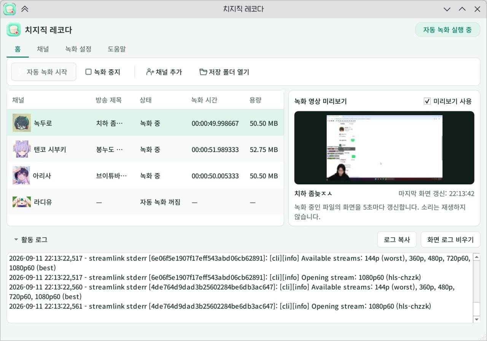
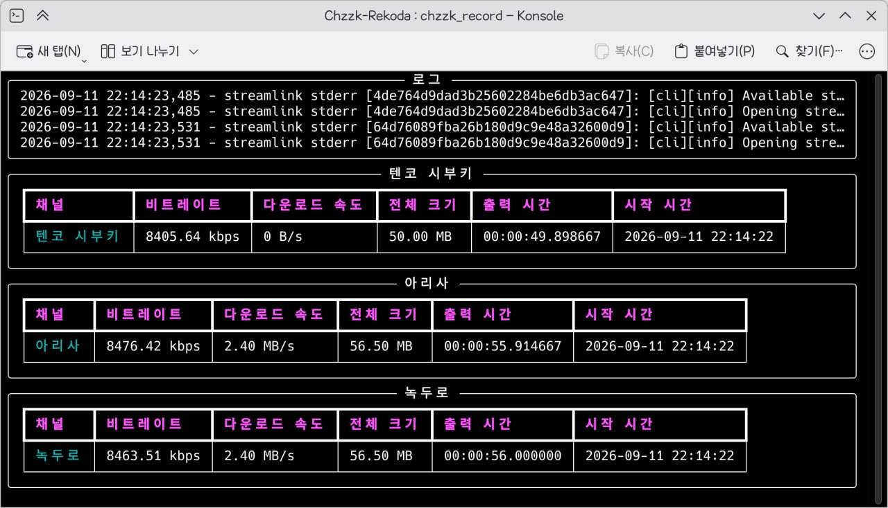

<table>
  <tr>
    <td width="58%" align="center">
      <a href="assets/screenshots/gui-recording.jpg"></a>
      <br><strong>GUI · 功能區操作與錄製預覽</strong>
    </td>
    <td width="42%" align="center">
      <a href="assets/screenshots/cli-recording.jpg"></a>
      <br><strong>CLI · 在終端查看錄製狀態</strong>
    </td>
  </tr>
</table>

<p align="center"><sub>點選圖片可查看原圖。</sub></p>

# CHZZK Rekoda（Chzzk-Rekoda）

**語言：** [한국어](README.md) | [English](README.en.md) | [简体中文](README.zh-CN.md) | [繁體中文](README.zh-TW.md) | [日本語](README.ja.md)

這是一個使用 Streamlink 和 FFmpeg 製作、支援 Windows、macOS、Linux 的 CHZZK 自動錄製程式。

它也是一個即使不熟悉電腦的人也能輕鬆使用的 **CHZZK 自動錄製程式**。  
直播開始時會自動開始錄製，直播結束後會自動儲存。

[[教學] 在 Android 手機上安裝程式](https://github.com/munsy0227/Chzzk-Rekoda/discussions/17)

[[TUTORIAL] How to Install Chzzk-Rekoda in Android Systems](https://github.com/munsy0227/Chzzk-Rekoda/discussions/18)

**[GUI 入門](#gui) · [安裝指南](#installation) · [使用 CLI](#cli) · [常見問題](#faq)**

---

<a id="gui"></a>

## 1. 從 GUI 開始

GUI 與現有 CLI 共用 `config.json`。

1. 依照[下方安裝指南](#installation)安裝，在最後的選擇畫面選擇 **1. GUI**。安裝完成後會開啟應用程式。
2. 首次啟動 GUI 會顯示語言、頻道搜尋及儲存資料夾精靈，按完成才儲存設定，也可以稍後新增頻道。從 **說明 → 初始設定** 可重新開啟。
3. 選擇 **首頁 → 開始自動錄製**。程式會等待已啟用頻道開播，然後開始錄製。之後可透過 **新增頻道** 新增更多頻道。

### 下次如何開啟 GUI

| 系統 | 啟動方式 |
| --- | --- |
| Windows | 按兩下 `chzzk_gui.vbs` · 不顯示 CMD 視窗（`chzzk_gui.bat` 使用同一啟動器） |
| Linux | 按兩下 `Chzzk-Rekoda.desktop` · 如有提示，請允許執行 |
| macOS | 在安裝資料夾的終端中執行 `./chzzk_gui` |

macOS/Linux 也可使用 `./chzzk_gui`。若要為現有 CLI 安裝加入 GUI，或直接透過 uv 啟動，請執行以下命令。只有 GUI 需要 Qt。

```bash
uv run --extra gui chzzk_gui.py
```

### 在功能區中調整設定

| 操作 | 選單 |
| --- | --- |
| 檔案格式與分割間隔 | **錄製設定 → 基本錄製** |
| 解析度與 FPS | **錄製設定 → 畫質** |
| H.264 · HEVC · AV1 編碼 | **錄製設定 → H.264 / HEVC / AV1** |
| 頻道個別資料夾、分割與畫質 | **右鍵頻道 → 編輯頻道** |
| 匯入登入 Cookie | **錄製設定 → NAVER 登入** |
| 語言、記錄與背景行為 | **錄製設定 → 應用程式 · 背景** |
| 完成檔案處理後結束 | **錄製設定 → 完全結束程式** |

按 **儲存設定** 套用變更。將游標停留在選項上，或使用說明按鈕/F1 查看說明。

### 需要 NAVER 登入的直播

GUI 需要桌面環境和 FFmpeg。**開啟登入視窗**直接啟動 CLI 的瀏覽器登入流程。在瀏覽器登入後，在獨立 CLI 視窗按 Enter，將 Cookie 傳回 GUI，再按 **儲存設定** 套用。GUI 本身不顯示 CMD 視窗，僅登入時開啟獨立 CLI 視窗。

<details>
<summary>展開查看畫質、編碼、預覽和系統匣等詳細功能</summary>

- 透過功能區依頻道名稱或 ID 搜尋、新增、編輯、取消註冊，並調整全部錄製設定。將游標停留於設定或使用 F1/說明按鈕查看說明。
- 頻道圖示優先使用 CHZZK 頭像，查詢失敗時顯示名稱首字。
- **每 5 秒更新所選頻道目前錄製檔案中的一格畫面**，不播放聲音。資料不足或無法讀取時顯示提示並重試。關閉預覽不會停止錄製。
- 預設關閉視窗後繼續在系統匣錄製，可透過圖示還原視窗或**結束**。應用程式設定中可關閉此行為；無系統匣時關閉視窗會結束。防止 CLI/GUI 重複錄製及設定覆寫衝突。
- 儲存的錄製選項套用至新的錄製工作。DNS 與檔案記錄變更需停止並重新啟動錄製器。

- 頻道名稱和狀態之間顯示原始直播標題。右鍵頻道可設定、取消註冊、開啟儲存資料夾或啟停自動錄製。
- 分割間隔與畫質可使用全域預設值或依頻道設定。關閉某頻道的分割後，該頻道儲存為單一檔案。
- 直接接收實際提供的 `144p`、`360p`、`480p`、`720p60`、`1080p60`。其他解析度需要編碼，僅變更 FPS 時使用相同解析度的串流。轉換使用所選編碼，未選時使用 H.264（WebM 為 VP9）。未提供的畫質從最接近的較高畫質或最佳畫質轉換。
- H.264 支援 libx264/NVENC/QSV/AMF/VAAPI/VideoToolbox，與 HEVC、AV1 只能啟用一個。硬體失敗時嘗試 libx264。H.264+WebM 儲存為 MKV。
- 僅當檔名過長而縮短並加上雜湊時，在影片或各分段旁產生保留原始標題的 UTF-8 `.txt`。短標題不產生 TXT。
- GUI 使用 `font/02_NotoSansCJK-TTF-VF/Variable/OTC/NotoSansCJK-VF.ttf.ttc`，依語言選擇 KR/JP/SC/TC 字型。Windows 使用 DirectWrite 與各顯示器的 DPI，字型目錄附帶 `LICENSE`。
- **錄製設定 → 完全結束程式**會等待錄製檔案處理完成後結束程式及系統匣。分割錄製容量為目前錄製產生的所有分段檔案實際大小總和。
- GUI 錄製停止時，記錄會區分停止命令、程式結束和通訊連線錯誤等原因。啟用檔案記錄後，也可在設定檔旁的 `log.log` 中查看。
- 視窗、工作列和系統匣使用相同的程式圖示。Windows 執行 `chzzk_gui.vbs` 後，會在安裝資料夾中產生附圖示的 **`Chzzk Rekoda.lnk`** 捷徑。Linux 啟動 GUI 時，會在使用者應用程式選單中註冊圖示和啟動項目。

</details>

---

<a id="installation"></a>

## 2. 安裝

**[下載程式 ZIP](https://github.com/munsy0227/Chzzk-Rekoda/archive/refs/heads/main.zip)** · **[GitHub 儲存庫](https://github.com/munsy0227/Chzzk-Rekoda)**

請閱讀並按照你正在使用的作業系統（Windows、Mac、Linux）對應的說明操作。
安裝過程中出現語言選擇畫面時，請先選擇想使用的語言。

### Windows 使用者

**第 1 步：下載程式**

1. 點選上方的 **下載程式 ZIP**，或在 GitHub 儲存庫中點選綠色 **[Code]** 按鈕。
2. 若使用 Code 選單，請點選 **[Download ZIP]**。若已使用上方的直接下載連結，請跳過此步。
3. 解壓縮下載的檔案。（建議解壓縮到「桌面」等容易找到的位置。）

（如果你可以使用 Git，請使用 Git。）

**第 2 步：執行安裝程式**

1. 進入解壓縮後的資料夾。
2. 找到 `install.bat` 檔案並雙擊執行。
3. 黑色視窗會開啟，並自動安裝所需檔案。可能需要一些時間，請等待。
4. 安裝最後選擇 **GUI / CLI**。GUI 完成安裝後開啟應用程式，CLI 啟動終端機設定選單。

---

### macOS / Linux 使用者

**第 1 步：開啟終端機**

- **Mac：** 按 `Command` + `Space`，搜尋「終端機」並執行。
- **Linux：** 執行你使用的終端機應用程式。

**第 2 步：輸入命令**
將下面的命令逐行複製到終端機中，然後按 Enter。

1. **下載程式**
   ```bash
   git clone https://github.com/munsy0227/Chzzk-Rekoda.git
   cd Chzzk-Rekoda
   ```

2. **安裝 FFmpeg（錄製必需）**
   - **Mac 使用者（需要 Homebrew）：**
     ```bash
     brew install ffmpeg
     ```
   - **Ubuntu/Debian 使用者：**
     ```bash
     sudo apt install ffmpeg -y
     ```
   - **Arch Linux 使用者：**
     ```bash
     sudo pacman -S ffmpeg uv
     ```

3. **執行安裝腳本**
   ```bash
   ./install
   ```

選擇 **1. GUI** 進入首次設定精靈；選擇 **2. CLI** 開啟終端設定選單。

---

<a id="cli"></a>

## 3. 使用 CLI

若偏好終端，請在安裝時選擇 **2. CLI**。GUI 與 CLI 共用 `config.json`，不需要重新新增頻道。

### 新增頻道與設定

必須先註冊想要錄製的實況主，錄製才會運作。  
如果安裝後設定畫面關閉了，請執行 `settings.bat`（Windows）或 `./settings`（Mac/Linux）。

1. 選單出現後，按鍵盤數字進行選擇。
   - **輸入 `1` 後按 Enter**：Channel Settings（頻道設定）
   - **輸入 `1` 後按 Enter**：Add Channel（新增頻道）

2. 選擇 **新增頻道的方式**。
   - **依頻道名稱搜尋**：輸入搜尋詞，然後從同時顯示名稱與 ID 的結果中選擇要新增的頻道。
   - **透過頻道 ID 直接新增**：輸入 CHZZK 頻道 URL 末尾的 ID，程式會自動查詢官方頻道名稱。

3. 確認查詢到的 **頻道名稱與 ID**。
   - 已註冊的 ID 會在搜尋結果中標示，無法重複新增。
   - 如果已註冊的其他 ID 使用相同名稱，程式會顯示現有 ID，方便區分同名頻道。

4. 輸入 **儲存路徑**。
   - 如果什麼都不輸入直接按 Enter，專案內會建立以官方頻道名稱命名的資料夾，並將錄影儲存在其中。
   - 如有需要，也可以輸入其他資料夾名稱或路徑。

5. 如果顯示的頻道名稱、ID 與儲存路徑正確，請輸入 `Y`。

> **提示：** 要錄製需要成人驗證或會員驗證的直播，請在設定選單的 **4. NAVER 登入** 中選擇透過新的 Chrome、Microsoft Edge 或 Firefox 視窗直接登入 NAVER 並匯入 Cookie（NID_AUT、NID_SES），或手動輸入 Cookie 值。首次使用瀏覽器登入方式時，準備相容的驅動程式可能需要網路連線。
> **2. 錄製與畫質**設定格式、分割、解析度與 FPS；**3. 編碼**選擇 H.264/HEVC/AV1；**5. 網路**設定 DoH；**6. 語言與記錄**設定語言與檔案記錄。頻道個別設定位於 **1. 頻道管理 → 4. 頻道分割與畫質**。`0` 表示返回或結束。

### 開始錄製

現在只要讓程式保持執行即可。

#### Windows

雙擊資料夾中的 `chzzk_record.bat` 檔案。

#### Mac / Linux

在終端機中輸入以下命令。
```bash
./chzzk_record
```

如果黑色視窗開啟並顯示文字，表示正在正常運作。  
**關閉此視窗會停止錄製，請保持開啟！**（可以最小化。）

---

<a id="faq"></a>

## 常見問題（FAQ）

**Q. 錄製的檔案在哪裡？**
A. 如果沒有另外指定儲存路徑，錄影會儲存在專案內以官方頻道名稱命名的資料夾中。 在 GUI 選擇頻道並按 **開啟儲存資料夾**，即可開啟錄影位置。

**Q. 如何關閉程式？**
A. 在 GUI 選擇 **錄製設定 → 完全結束程式**，等待錄製檔案處理完成後結束。預設關閉視窗會隱藏至系統匣。CLI 請在執行中的終端按 `Ctrl` + `C`。

**Q. 發生錯誤！**
A. 請到 [Issues](https://github.com/munsy0227/Chzzk-Rekoda/issues) 描述症狀，我們可以協助你。

---

## 免責聲明及注意事項

- 本程式是根據 **MIT 授權條款** 發布的開源軟體。
- 軟體按 **「原樣（AS IS）」** 提供，因使用程式而產生的一切結果的法律責任完全由 **使用者本人** 承擔。
- **錄製的影片不得在私人用途及實況主指定範圍之外未經許可使用，影片使用的一切責任由錄製該影片的使用者承擔。**
- **上傳完整影片的行為（無論公開或非公開）均違反著作權法**，著作權人可能提起訴訟。
- 為防止 Deepfake，**作為 AI 訓練資料使用的行為也可能被禁止。**

### 著作權相關範例（라디유）
- 著作權已根據 라디유 的意願委託給 Sandbox Network。
- 作為 AI 訓練資料使用的行為同樣屬於著作權侵權。
- 除官方粉絲社群外，剪輯不能上傳到其他地方。（不限於公開或非公開）
- 即使遵守了指南，也可能根據 라디유 或 Sandbox Network 的判斷被刪除。

### 非官方專案說明
本專案及貢獻者與 **NAVER**、**CHZZK** 或其關係企業及子公司不存在任何合作、授權、批准或官方連結關係。本專案是為了提供便利而開發的獨立、非營利、非官方程式。

### 商標說明
包括「CHZZK」、「NAVER」在內的相關名稱、標誌、徽章和圖像均為相應所有者的註冊商標。這些商標僅用於識別和引用目的，不暗示與商標權人的任何關聯。本專案明確聲明無意侵犯相關商標權或對商標權人造成損害。

### 著作權和條款遵守
本專案不主張對串流影片、音訊或其他第三方內容擁有所有權，也不授予這些內容的任何授權。使用者有責任自行確認並遵守相關著作權法、平台政策（如 CHZZK 使用條款等）和當地法律。透過本專案進行儲存、複製、散布、傳輸或商業使用的責任完全由使用者承擔。
